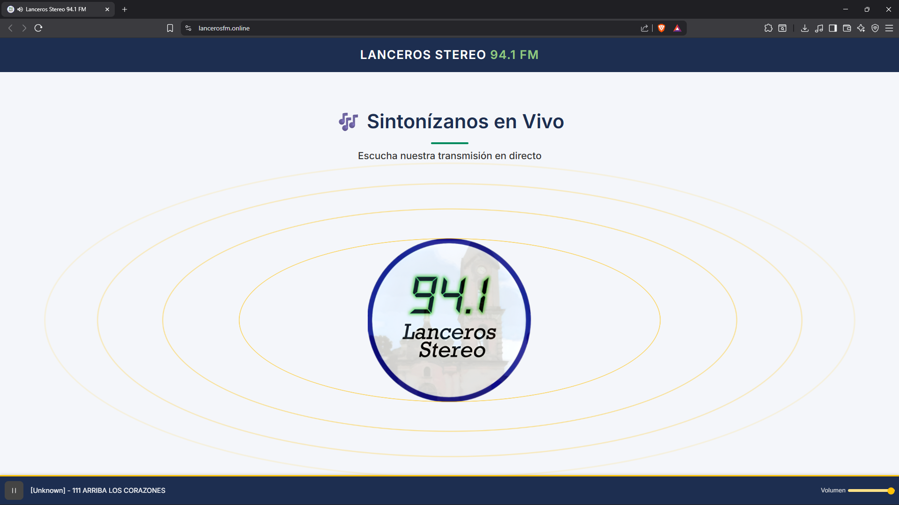

# 📻 Lanceros Stereo 94.1 FM

Aplicación web oficial de la emisora **94.1 Lanceros Stereo FM**, una estación de radio ubicada en **Tuta, Boyacá (Colombia)**.  
Este proyecto está construido con **Angular** y permite a los oyentes disfrutar de la transmisión en vivo, visualizar información en tiempo real de la programación y contar con una interfaz atractiva, optimizada para diferentes dispositivos y redes sociales.

🌐 Sitio en producción: [https://lancerosfm.online](https://lancerosfm.online)  
📦 Repositorio: [GitHub - juanitomanoplateada/lanceros-stereo](https://github.com/juanitomanoplateada/lanceros-stereo)

---

## 🚀 Propósito y Alcance

La aplicación está diseñada para:

- 📡 Transmitir en vivo el audio de la emisora **94.1 FM** directamente en navegadores web.
- 🎶 Mostrar **metadatos en tiempo real** sobre el contenido que se está reproduciendo.
- ✨ Ofrecer una **interfaz visual animada** y moderna.
- 📱 Adaptarse a **dispositivos móviles y de escritorio** mediante diseño responsivo.
- 🔍 Implementar **SEO y optimización para redes sociales**.

---

## 🏛️ Arquitectura del Sistema

El sistema sigue una arquitectura moderna de Angular con separación clara entre:

- **Presentación visual** (`app-header`, `app-footer`, `app-player`)
- **Controles funcionales** (`app-radio-player`)
- **Gestión de estado y streaming** (SSE, RxJS, Angular services)

📂 Estructura principal:

- `app-header` → navegación y branding  
- `main.main` → componente principal del reproductor  
- `app-player` → efectos visuales y estado de transmisión  
- `app-radio-player` → controles de audio (play/pause, volumen, metadata)  
- `app-footer` → información institucional  

---

## ⚙️ Tecnologías Utilizadas

| Tecnología      | Versión  | Propósito                        |
|-----------------|----------|----------------------------------|
| Angular         | 20.0.0   | Framework principal              |
| TypeScript      | 5.8.2    | Lenguaje de programación         |
| RxJS            | 7.8.0    | Programación reactiva            |
| Lucide Angular  | 0.544.0  | Iconografía                      |
| SCSS            | -        | Estilos personalizados           |

📄 Fuente: [`package.json`](package.json)

---

## 🖥️ Punto de Entrada

La aplicación inicia en [`src/index.html`](src/index.html), el cual incluye:

- Idioma configurado en **español**
- Título: `Lanceros Stereo 94.1 FM`
- **SEO**: meta tags orientados a "música, comunidad y cultura desde Tuta, Boyacá"
- **Open Graph**: imagen de 1200x630 para compartir en redes
- **Twitter Cards**: vista previa enriquecida
- Favicon personalizado: `LS94_1.png`
- Elemento de montaje de Angular: `<app-root></app-root>`

---

## ✨ Características Principales

### 🎧 Transmisión en Vivo
- Reproducción en tiempo real mediante **HTML5 Audio API**.
- Control de **volumen y reproducción** (play/pause).
- Manejo de **estado de conexión** y errores.

### 🎨 Experiencia Visual
- Efectos animados sincronizados con el estado de reproducción.
- **Diseño responsive** para móviles y escritorio.
- Branding de la emisora con colores e identidad visual.

### 📰 Integración de Metadata
- Actualización en vivo de canciones/programas con **SSE (Server-Sent Events)**.
- Visualización de la pista en reproducción.
- Historial de canciones reproducidas.

### 📢 SEO y Redes Sociales
- Metadatos optimizados para Colombia.
- Implementación completa de **Open Graph y Twitter Cards**.
- Banner social (`public/banner.png`) en resolución 1200x630.

---

## 🛠️ Scripts de Desarrollo

El proyecto utiliza Angular CLI con los siguientes comandos:

```bash
# Servidor de desarrollo
npm run start  # o ng serve

# Compilación para producción
npm run build  # o ng build

# Compilación en modo watch
ng build --watch

# Pruebas unitarias
npm run test   # o ng test
```

---

## 🖥️📱 Vista Previa

### Escritorio


### Móvil


